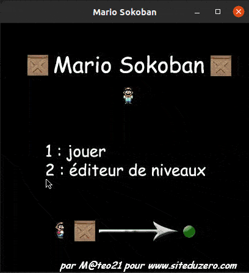

# A simple mario sokoban game written in c using sdl library
## Linux user 
###   -before run the game you must install sdl 1.2 version(version is important)  library first with command : "apt-get install libsdl1.2-dev"
###   - you can start the game by execute the  compiled file main in "Sources" folder, just tap `./main`
   -when you get on menu press the "1" button on keybord and the game will start
   
  

###   - if you want to make some changes for compile just use the `make` command or  "gcc main.c game.c file.c custom.c  -o main -lSDL_image   `sdl-config --libs --cflags --static-libs  `"
## Window user
